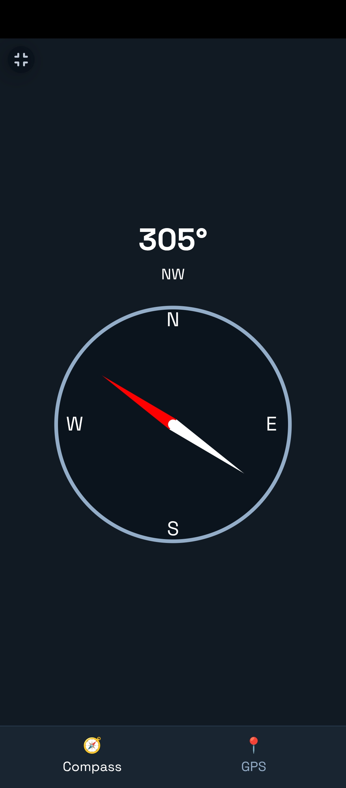
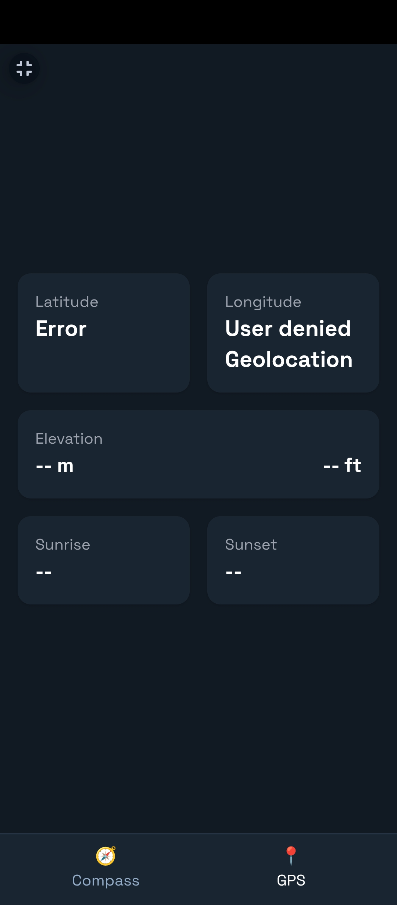

# 📍 Real Compass & GPS Web App

A mobile-friendly web application that displays a **live compass**, **GPS coordinates**, **elevation**, and **sunrise/sunset times** for your location.  
Designed with **Tailwind CSS** and optimized for phones.

---

## 📸 Screenshots

---
## 🚀 Features
- 🧭 **Live Compass** (works with device orientation sensors)
- 📍 **GPS Coordinates** (Latitude & Longitude)
- ⛰ **Elevation** (in meters & feet) from [Open-Elevation API](https://api.open-elevation.com/)
- 🌅 **Sunrise & Sunset Times** from [Sunrise-Sunset.org API](https://sunrise-sunset.org/api)
- 📱 **Mobile-Optimized UI** with two main screens:
  - **Compass Screen** – Live heading & cardinal direction
  - **GPS Screen** – Coordinates, elevation, and sun times in a card grid
- 🎨 Minimal, dark-themed design with Tailwind CSS

---

## 🛠 How It Works
1. **Compass**
   - Uses the `deviceorientationabsolute` event to read heading (works on most mobile browsers)
   - iOS devices require **user permission** to access motion sensors

2. **GPS**
   - Uses `navigator.geolocation.watchPosition()` to get your current location
   - Elevation is fetched from Open-Elevation API
   - Sunrise/Sunset times are fetched from Sunrise-Sunset.org

---

## 📂 Files
- `index.html` – Main HTML + CSS + JavaScript in one file
- `README.md` – This file

---

## 🌐 How to Use
1. Open `index.html` in a mobile browser
2. Allow **location access**
3. On iOS, tap "Allow" when asked for **motion & orientation access**
4. Switch between **Compass** and **GPS** tabs using the bottom navigation

---

## ⚙️ APIs Used
- **Open-Elevation API** – `https://api.open-elevation.com/api/v1/lookup`
- **Sunrise-Sunset API** – `https://api.sunrise-sunset.org/json`

Both APIs are **free** and do not require authentication keys.

---

## 📸 Screenshots
*(Optional — Add screenshots here)*

---

## 📜 License
This project is released under the **MIT License**.  
You can freely modify and use it for personal or commercial projects.
